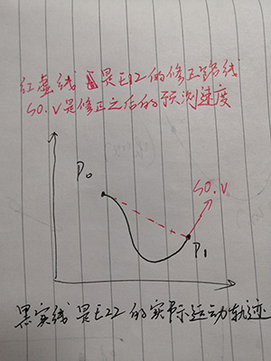

# 联网版SpaceShooter

## 简介

将unity官方demo：SpaceShooter改造成联机版本，


演示了两种位置同步策略：

1. 固定时间间隔的发送同步信息
2. 航位推算策略

三种位置修正策略：

1. 直接位置修正
2. 线性插值平滑修正
3. 立方体插值平滑修正

   可以在玩家实体的prefab中进行选择


## 位置同步策略

我对位置同步策略的定义是玩家实体发送自己位置的频率以及时机。

最简单的是每次渲染循环都发送一次，显然这样的话会消耗大量的网络资源。故我们只能以低于游戏渲染循环的速率去同步实体的位置。

后文中，一直假设我们的客户端是玩家1，另外一方是玩家2。

这样的话，对于玩家1来说，获得的玩家2实体的位置数据是离散的（相对于渲染循环来说），于是我们只能用这些离散的数据去模拟玩家2实体运动的轨迹，一般的模拟方式是在位置数据包中增加实体的速度和加速度（根据不同游戏的实际情况），我们称该包为运动数据包。

```
//数据包中有的数据
Packet MotionState
{
    public Vector3 position;
    public Vector3 rotation;
    public Vector3 velocity;
}
```

### 固定时间间隔的同步策略

首先想到的是是按固定时间间隔地同步玩家实体的位置，例如每0.2s发送一次玩家的位置数据。但是玩家在不动的时候，我们会浪费大量的流量去同步玩家不变的位置，并且玩家在剧烈地改变自己的速度、方向的时候会出现不够真实的模拟（例如在猛然拐弯并被撞击的时候）。

### 基于航位推算的同步策略

玩家1每次发送的位置数据的时候，会将当时的位置、速度等记录下来，记为lastMotionState，并进行模拟：

即定义一个drPosition，在游戏循环中

```
drPostion = lastMotionState.position + 
lastMotionState.velocity * (Time.time - lastMotionState.lastSyncTime);
```

当drPosition和玩家1当前实体位置的差距高于阈值的时候，我们才发送玩家1的运动信息：

```
if ((drPostion - transform.position).sqrMagnitude >= deadReckoningThreshold)
{
     SendMotionState();//发送运动数据包给服务器
}
```

这样做的好处是不仅可以节省玩家静止时发送的运动数据流量，而且当玩家的速度保持不变时也同样可以节省流量，同时当玩家的位置出现剧烈变化的时候我们同步运动数据的频率也会相应地增大，达到动态调节的效果。


## 位置修正策略

前文提到，由于由网络运动数据包驱动的玩家实体获得的运动数据是离散的，故我们只能用这些离散的数据去模拟玩家2实体运动的轨迹，如何模拟呢？

为了模拟，我们在运动数据包中加入了速度和加速度，首先设想最初始的情况：玩家2的客户端第一次发送自己的运动数据包S0给服务器，设此刻为T0，设S0.p为T0时刻E22位置，S0.v为T0时刻E22速度，S0.a为T0时刻E22的加速度。

假设玩家1和玩家2的客户端中，玩家2的实体初始位置已经一致了，并且是静止的，设玩家1客户端内玩家2的实体为E12，玩家2客户端内玩家2的实体为E22。

在T0的时候，E12还在原地p0，E22已经偏离p0大于阈值了，记该位置为p0'。

经过了网络延时delta之后，E22的运动数据包到达玩家1客户端，设此时为T1，玩家1客户端中需要将E12的位置修正到S0.p上，一种改进的方法是修正到S0.p + S0.v*delta + 0.5 * S0.a * delta^2，这是基于E22从T0时刻后都未改变过速度和加速度情况下的假设，虽然从T0到T1这段长delta的时间段内，E22的速度和加速度是有可能变化的。我们设修正之后的位置为p1，修正的策略有很多种，一般都是在delta时间内修正完毕，然而下一个运动数据包不一定会在delta时间后准时到达，于是我们会使用S0.v和S0.a来预测E12后面的运动状态，这也是航位推算在网络游戏模型中的另一种应用。

接下来介绍一些位置修正的策略：

### 直接位置修正

直接位置修正意味着在T1，将E12的位置从p0瞬间移动到p1，在接下来的时间内，E12将以S0.v的速度和S0.a的加速度移动，这样做的好处是，若E22的加速度和速度保持不变的话，两个玩家的屏幕将看到完全一致的同步效果。但是缺陷很明显，E22的速度和加速度频繁变化的话，E12会发生剧烈的跳变。

### 线性插值平滑修正

在T1，E12接受到E22的运动数据后，我们不将E12马上瞬移，而是在delta时间内将E12平滑地线性插值到p1，当插值到p1之后，我们再将S0.v应用于E11用于预测。

线性插值的问题在于，平滑的过程的速度（从p0到p1）与位置修正完之后的预测速度会出现不一致，当E22的运动轨迹是非直线的时候。当延迟大并且E22的运动轨迹非常曲折的时候，会看到E12表现出僵硬的平移。



### 立方体插值平滑修正

而立方体插值想要达到的目的便是得到一条修正曲线，该曲线在P0附近的斜率接近P0处E12的速度，并使得E12在修正阶段将要到达p1的时候，其曲线的斜率（修正的速度）接近S0.v，这样便可以使得E12的运动轨迹更加平滑。

可以发现，在线性插值修正实体位置的时候，我们只用到了E12在P0和P1处的位置，若我们也用上E12在P0和P1处的速度和加速度，那么就可以得到这样一条曲线了。

要构造这样一个曲线，我们列出如下三次方程：

$$x = At^3 + Bt^2 + Ct + D;​$$

$$y = Et^3 + Ft^2 + Gt + H;$$

若是二次平面的话，我们有八个未知量，要求解八个未知量的话，我们需要除了P0和P1外的其他两个点。

我们令另外两个点为P0',P1'。

P0' 为E12在P0点以S0.a的加速度和S0.v的速度运动dt后到达的点，dt可以设为服务器每次更新的间隔。

P1'为E12在P1点以S1.a的加速度和S1.v的速度逆时光运动dt后到达的点。

代入了四个点后即可求得八个参数，E12的位置在修正时间内将以更平滑的曲线移动。

# 参考

gamedev网站的技术文章：http://www.gamedev.net/page/resources/_/technical/multiplayer-and-network-programming/defeating-lag-with-cubic-splines-r914


